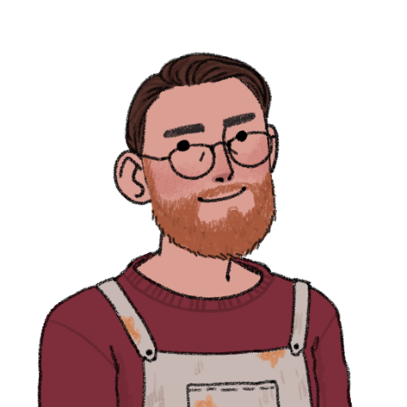

# Projetos de Estudo

Esse é um registro dos meus estudos iniciais de HTML e CSS criando mini-projetos utilizando os conhecimentos adquiridos até então!

1. ## Obasorac

    Esse primeiro projeto foi criado com a idéia de um site para a rádio de uma cidade fictícia chamada Obasorac. Coloquei em prática **conceitos de CSS e imangens responsívas**.

    * <a href="https://andrekurihara.github.io/PROJETOS/Projeto-Obasorac/html/index.html">Acesse o projeto aqui.</a>

2. ## Texas Store

    Nesse segundo projeto a idéia foi utilizar o **efeito paralax** em um contexto de uma página de loja. Também utilizei imagens responsívas para adaptar em telas menores.

    * <a href="https://andrekurihara.github.io/PROJETOS/projeto-loja/loja.html">Acesse o projeto aqui.</a>

    